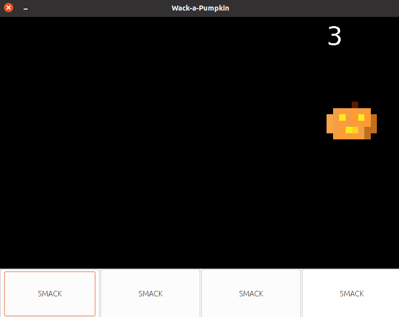
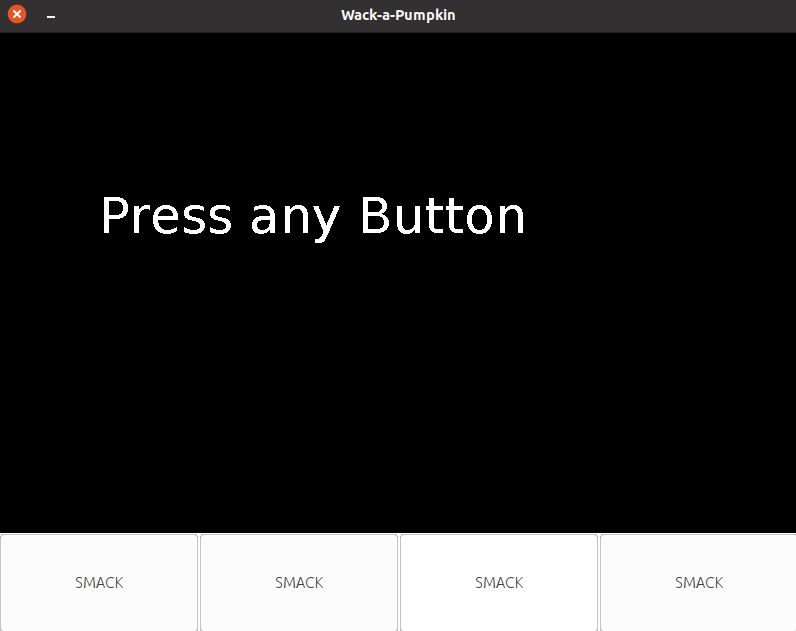

# Prüfung 2: Wack-a-Pumpkin



In diesem Projekt implementieren Sie das Spiel "Wack-a-Pumpkin". **Folgen Sie den Anweisungen Schritt für Schritt um den besten Erfolg zu erzielen**.

## Zeit: 45 Minuten

## Erlaubte Hilfsmittel

- Sie dürfen eigene Übungen verwenden.
- Cheatsheet von OOP1 ist erlaubt.
- Slides von OOP1 sind erlaubt
- Keine Kommunikation während der Prüfung.
- Kein Abschreiben.
- Keine sonstigen Hilfsmittel.

## Umlaute in diesem File

Falls Umlaute falsch dargestellt werden gehen Sie folgendermassen vor:

Rechtsklick auf `README.md` > `Properties` > `Text File Encoding` > `Other` > `UTF-8`

## Vorgehensweise

Viele Teile der Applikation sind bereits im Code vorgegeben. Implementieren Sie die zusätzlichen Teile gemäss Vorgehen unten.

Implementieren Sie die Klasse `WackPanel.java` gemäss der Aufgabenstellung. Senden Sie den Inhalt von `WackPanel.java` als E-Mail an die Adresse `manuel.dicerbo@fhnw.ch`.

1. Starten Sie `WackApp.java` um zu verifizieren, dass Sie das Projekt importieren können.
2. Öffnen Sie `WackPanel.java`, hier Implementieren Sie den Code.
3. Folgen Sie Schritt für Schritt der Aufgabe.
4. Formatieren Sie Ihren Code regelmässig mit `Shift + Ctrl + F`.

## 1. `paintComponent`

Folgen Sie der Anweisung in `paintComponent` um den den schwarzen Hintergrund und das weisse Panel zu zeichnen.

## 2. `drawWelcomeScreen`

Implementieren Sie die Methode `drawWelcomeScreen`.



## 3. Buttons in `init`

In `init` finden Sie einen `for` Loop. Innerhalb des Loops finden Sie ein `//TODO`. Folgen Sie den Anweisungen und erstellen Sie *innerhalb* des `for` Loops einen Button mit der Bezeichnung *SMACK*.

## 4. `drawGameScreen` implementieren

Verwenden Sie `g.drawImage` um einen Pumpkin an der Stelle `pumpkinX` und `pumpkinY` zu zeichnen. Breite und Höhe sind je `100` Pixel. Verwenden Sie deshalb `drawImage(Image image, int x, int y, int width, int height, Observer observer)`. Für `observer` verwenden Sie einfach `null`.

`drawString` nimmt nur Strings entgegen. Sie können einen int mit concatenation umwandeln: `"Number: " + 5`.

Beachten Sie, dass wir die X-Y Koordinate von Pumpkin noch nicht zufällig gesetzt haben.

Falls Sie alles richtig gemacht haben, zählt der Counter nun hoch, wenn Sie den Button des entsprechenden Korridors drücken.


## 5. Pumpkin Random auf dem Screen setzen mit `spawn`

Implementieren Sie die Methode `spawn` entsprechend der Beschreibeung in `//TODO`. Ersetzen Sie `x = ` und `y = ` mit der gefragten Implementierung. Verwenden Sie Typecasts falls notwendig. Lassen Sie `pumpkinX` und `pumpkinY` aber so stehen. 

Verifizieren Sie nun, ob das Spiel funktioniert! Als letztes implementieren wir den Highscore screen!

## 6. `drawHighscoreScreen`

Implementieren Sie die Methode `drawHighscoreScreen`.

## 7. `getTime`

Das Spiel ist fast fertig! `getTime` sollte die Anzahl Sekunden liefern, welche Sie brauchen um das Spiel zu beenden. Implementieren Sie die Methode entsprechend.

## 8. Pumpkin explodiert

Zeichnen Sie nach dem treffen von Pumpkin `10` Frames lang das Bild `pumpkin_struck.png` an. Verwenden Sie eine Bildwiederholfrequenz von 60Hz.

Sie können das Bild am Anfang des Klassenrumpfs analog zu `pumpkin.png` laden:

```java
BufferedImage imageStruck = ImageHelper.loadImage("res/pumpkin_struck.png");
```
Tipp: Hierzu muss ein Timer erstellt werden.
Tipp: verwenden Sie eigene (x,y) Koordinaten für `imageStruck`.

Beispieltimer:

```java
new Timer(16, new ActionListener() {
	@Override
	public void actionPerformed(ActionEvent e) {
		
	}
}).start();
```


## DONE!

Senden Sie den Inhalt von `WackPanel.java` als E-Mail an die Adresse `manuel.dicerbo@fhnw.ch`. Lassen Sie sich das E-Mail bestätigen!

***BONUS***: senden Sie auch einen Screenshot Ihrer Highscore.


